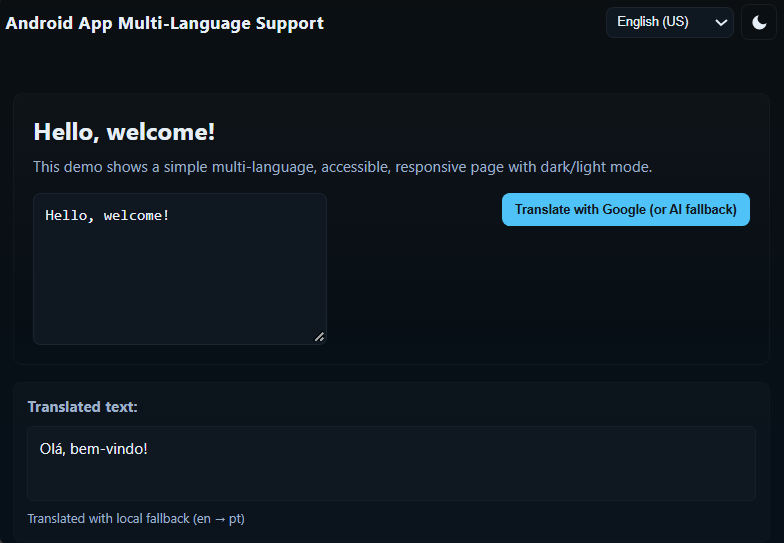

# Creating an Android App with Multi-Language Support

Project developed during the Santander Bootcamp 2023 - Mobile Android with Kotlin, under the guidance of [Igor Rotondo Bagliotti](https://github.com).

This is a hybrid Android application that uses a native Kotlin container (`WebView`) to render a web interface focused on internationalization (i18n) and accessibility.

## Features

- **Multi-language UI**: Support for English (EN-US), Portuguese (PT-BR), and Spanish (ES) with runtime switching and persistence.
- **Dark / Light Mode**: Theme toggle with preference saved in `localStorage`.
- **Accessibility**: Keyboard navigation, ARIA attributes, skip links, and visible focus styles.
- **Responsive Layout**: Fluid design tailored for mobile (via WebView), tablets, and desktop.
- **AI Translation Fallback**: A simulated translation function ready to be connected to a real API.

## Tech Stack & Requirements

### Mobile (Android Container)
- **Kotlin 1.8+**
- Android Studio Flamingo (or newer)
- Android SDK (API 21+)

### Web Frontend
- **HTML5**: Semantic tags, accessible controls, and ARIA attributes.
- **CSS3**: Core variables for theme management and responsive layout.
- **JavaScript**: Core logic for language switching, theme persistence, and AI simulation.

## How to Run

### 1. Android App (Emulator/Device)
1. Open the project folder in **Android Studio**.
2. Sync the Gradle files.
3. Run the project on an emulator or physical device (API 21+).

### 2. Web Interface Standalone (Browser)
1. Open `index.html` directly in any modern browser.
2. Use the language selector or theme toggle - your preferences will persist.
3. Click "Translate with AI fallback" to see the mock translation in action.

## Accessibility Details

- Includes a skip link for keyboard-only users.
- `aria-live` regions to announce dynamic translation changes to screen readers.
- High contrast color variables.

## Future Improvements

- Replace the mock `aiTranslate` function in `script.js` with a real translation API (via `fetch`).
- Add more languages by expanding the `TRANSLATIONS` object.

[LICENSE](./LICENSE)
